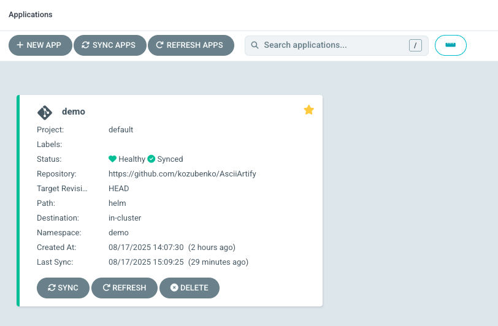

Okay, let's take your original Markdown guide and apply the improvements we discussed. I'll focus on clarity, flow, and consistent formatting to make it even more user-friendly.

-----

# 🚀 Getting Started with Argo CD

This guide provides the steps to install and configure **Argo CD** for a local development environment using **Kind**.

-----

## ✅ Requirements

  * **`kubectl`** command-line tool installed.
  * A valid **`kubeconfig`** file (default: `~/.kube/config`).
  * **`kind`** installed and a cluster created.
  * **CoreDNS** enabled.

-----

## 🖥️ Local Installation with Kind

This section shows you how to set up a local development environment.

### 1\. Install Kind and Create a Cluster

First, follow the quick start guide [here](https://www.google.com/search?q=https://kind.sigs.k8s.io/docs/user/quick-start/%23installation) to install **Kind**. Then, create a local cluster:

```bash
kind create cluster --name argocd-cluster
kubectl cluster-info --context kind-argocd-cluster
```

### 2\. Install Argo CD

Now, apply the installation manifests to the Kind cluster:

```bash
kubectl create namespace argocd
kubectl apply -n argocd -f https://raw.githubusercontent.com/argoproj/argo-cd/stable/manifests/install.yaml
```

> **Tip:** You can configure CLI access faster using `argocd login --core`.

### 3\. Access the UI

To access the UI, expose the Argo CD API server locally via port-forwarding:

```bash
kubectl port-forward svc/argocd-server -n argocd 8080:443
```

Now, open `http://localhost:8080` in your web browser.

### 4\. Log In to Argo CD

Retrieve the default admin password with the following command:

```bash
kubectl -n argocd get secret argocd-initial-admin-secret -o jsonpath='{.data.password}' | base64 -d
```

  * **Username:** `admin`
  * **Password:** *the value retrieved from the command above*

You can now log in to the UI or CLI and start creating and syncing applications.

Once logged in, you can follow [this step](https://argo-cd.readthedocs.io/en/stable/getting_started/#6-create-an-application-from-a-git-repository) to create and test a sample application. The result will look something like this:



If you encounter any issues, please refer to the [original Argo CD guide](https://argo-cd.readthedocs.io/en/stable/getting_started/) or contact us for direct help.